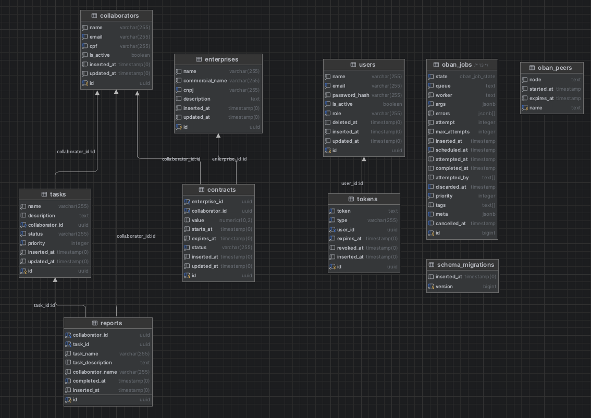

# Documentação da API — ash/recruitment

## Índice

1. [Visão Geral](#visão-geral)
2. [Stack Tecnológica](#stack-tecnológica)
3. [Arquitetura da Aplicação](#arquitetura-da-aplicação)
   - [Padrão de Contextos (DDD)](#padrão-de-contextos-ddd)
   - [Padrão de Services](#padrão-de-services)
4. [Banco de Dados](#banco-de-dados)
   - [Diagrama](#diagrama)
   - [Tabelas e Schemas](#tabelas-e-schemas)
   - [Migrações](#migrações)
5. [Autenticação e Autorização](#autenticação-e-autorização)
   - [Guardian (JWT)](#guardian-jwt)
   - [Tokens de Acesso e Refresh](#tokens-de-acesso-e-refresh)
   - [Middleware GraphQL](#middleware-graphql)
   - [Plugs HTTP](#plugs-http)
6. [API REST](#api-rest)
   - [Porque REST?](#porque-rest)
7. [API GraphQL](#api-graphql)
   - [Visão Geral do Schema](#visão-geral-do-schema)
   - [Paginação](#paginação)
   - [Filtros](#filtros)
   - [Enums](#enums)
   - [Dataloader (N+1)](#dataloader-n1)
8. [Regras de Negócio](#regras-de-negócio)
   - [Usuários (Users)](#usuários-users)
   - [Colaboradores (Collaborators)](#colaboradores-collaborators)
   - [Empresas (Enterprises)](#empresas-enterprises)
   - [Contratos (Contracts)](#contratos-contracts)
   - [Tarefas (Tasks)](#tarefas-tasks)
   - [Relatórios (Reports)](#relatórios-reports)
9. [Jobs Assíncronos (Oban)](#jobs-assíncronos-oban)
   - [WelcomeUser](#welcomeuser)
   - [GenerateReport](#generatereport)
   - [DailyReportSummary](#dailyreportsummary)
10. [Validadores e Utilitários](#validadores-e-utilitários)
    - [UUID Guard](#uuid-guard)
    - [Token Hash](#token-hash)
    - [Validador de CNPJ](#validador-de-cnpj)
11. [Observabilidade e Logging](#observabilidade-e-logging)
    - [Camadas de Logging](#camadas-de-logging)
    - [Metadados de Log](#metadados-de-log)
    - [Redação de Dados Sensíveis](#redação-de-dados-sensíveis)
    - [Phoenix Filter Parameters](#phoenix-filter-parameters)
12. [E-mails (Swoosh)](#e-mails-swoosh)
13. [CORS](#cors)
14. [Dependências](#dependências)
15. [Configuração por Ambiente](#configuração-por-ambiente)
    - [Desenvolvimento (`dev.exs`)](#desenvolvimento-devexs)
    - [Teste (`test.exs`)](#teste-testexs)
    - [Produção (`runtime.exs`)](#produção-runtimeexs)
16. [Docker e Deploy Local](#docker-e-deploy-local)
    - [Dockerfile](#dockerfile)
    - [`entrypoint.sh`](#entrypointsh)
    - [Docker Compose](#docker-compose)
17. [Considerações Finais](#considerações-finais)

---

## Visão Geral

A **ash/recruitment** é uma API backend construída em **Elixir/Phoenix** que fornece uma plataforma de gestão de empresas e tarefas. A aplicação permite gerenciar **usuários**, **colaboradores**, **empresas**, **contratos**, **tarefas** e **relatórios** através de uma API GraphQL completa e endpoints REST para autenticação.

**Principais características:**

- API GraphQL com Absinthe (queries, mutations, paginação, filtros)
- Autenticação JWT com Guardian (access + refresh tokens)
- Autorização baseada em roles (admin/user)
- Jobs assíncronos com Oban (emails, relatórios)
- Validação de CNPJ via API externa (BrasilAPI)
- Imutabilidade de dados: Soft delete para usuários, colaboradores e contratos.
- Geração automática de relatórios ao completar tarefas
- Envio diário de resumo de relatórios por email (CRON)
- Logging estruturado em toda a aplicação
- Arquitetura baseada em contextos (DDD)

---

## Stack Tecnológica

| Tecnologia     | Versão           | Propósito                        |
| -------------- | ---------------- | -------------------------------- |
| **Elixir**     | ~> 1.14 (1.19.3) | Linguagem principal              |
| **Erlang/OTP** | 28.1.1           | Runtime da BEAM VM               |
| **Phoenix**    | ~> 1.7.18        | Framework web                    |
| **Absinthe**   | ~> 1.7           | Framework GraphQL                |
| **Ecto**       | ~> 3.10          | ORM / Query builder              |
| **PostgreSQL** | 17               | Banco de dados relacional        |
| **Guardian**   | ~> 2.3           | Autenticação JWT                 |
| **Bcrypt**     | ~> 3.0           | Hash de senhas                   |
| **Oban**       | ~> 2.19          | Jobs assíncronos / Filas         |
| **Swoosh**     | ~> 1.5           | Envio de emails                  |
| **Resend**     | —                | Provedor de email (produção)     |
| **Dataloader** | ~> 1.0.11        | Batch loading (N+1)              |
| **HTTPoison**  | ~> 2.3           | Cliente HTTP (BrasilAPI)         |
| **Bandit**     | ~> 1.5           | Servidor HTTP (substitui Cowboy) |
| **Corsica**    | ~> 1.0           | Middleware CORS                  |
| **Jason**      | ~> 1.2           | Serialização JSON                |
| **Docker**     | —                | Containerização                  |

---

## Arquitetura da Aplicação

```
API/
├── config/                          # Configurações por ambiente
│
├── lib/
│   ├── recruitment_test/            # Camada de Domínio (Backend)
│   │   ├── guardian.ex              # Configuração JWT (Guardian)
│   │   ├── release.ex               # Tasks de release (migrações)
│   │   ├── schema.ex                # Schema base (UUIDs)
│   │   │
│   │   ├── contexts/                # Contextos de domínio (DDD)
│   │   │   ├── content.ex           # Dataloader source
│   │   │   ├── accounts/            # Contexto: Contas de usuário
│   │   │   ├── collaborators/       # Contexto: Colaboradores
│   │   │   ├── enterprises/         # Contexto: Empresas
│   │   │   ├── contracts/           # Contexto: Contratos
│   │   │   ├── tasks/               # Contexto: Tarefas
│   │   │   └── reports/             # Contexto: Relatórios
│   │   │
│   │   ├── jobs/                           # Workers assíncronos (Oban)
│   │   │   ├── welcome_user.ex             # Email de boas-vindas
│   │   │   ├── generate_report.ex          # Geração de relatório
│   │   │   └── daily_report_summary.ex     # Resumo diário
│   │   │
│   │   └── utils/                   # Utilitários
│   │       └── validators/          # Validadores customizados (Validação externa de CNPJ e validação de UUID via Guard)
│   │
│   └── recruitment_test_web/        # Camada Web (Interface)
│       ├── endpoint.ex              # Endpoint Phoenix (middleware pipeline)
│       ├── router.ex                # Definição de rotas
│       ├── telemetry.ex             # Métricas e instrumentação
│       │
│       ├── controllers/             # Controllers REST
│       │   ├── auth_controller.ex   # Login, logout, refresh
│       │   ├── user_controller.ex   # Criação de usuários (REST)
│       │   ├── health_controller.ex # Health check
│       │   └── error_json.ex        # Error handler
│       │
│       ├── plugs/                   # Plugs (Middleware HTTP)
│       │   ├── authenticate.ex      # Validação JWT
│       │   ├── graphql_context.ex   # Contexto GraphQL
│       │   ├── require_role.ex      # Verificação de role
│       │   └── request_logger.ex    # Log de requisições
│       │
│       └── graphql/                 # Camada GraphQL
│           ├── schema.ex            # Schema principal Absinthe
│           ├── types/               # Definição de tipos
│           ├── resolvers/           # Resolvers (lógica de resolução)
│           ├── middleware/          # Middleware Absinthe
│           └── helpers/             # Helpers (paginação)
└── test/                            # Testes
    ├── support/                     # Helpers de teste
    ├── recruitment_test/            # Testes de domínio
    └── recruitment_test_web/
        ├── controllers/             # Testes de controllers
        └── graphql/                 # Testes GraphQL
```

### Padrão de Contextos (DDD)

A aplicação segue o padrão de **Contextos** do Phoenix, entretanto, foi feita uma mudança mais inspirado em Domain-Driven Design. Cada contexto encapsula uma área de domínio com seus schemas, services e regras de negócio. Dessa maneira evitamos a mistura de lógica e mantemos uma separação clara entre as responsabilidades.

```
contexts/
├── accounts/          # Gestão de contas de usuário
│   ├── user.ex        # Schema + changeset + validações
│   ├── token.ex       # Schema de tokens (refresh/access)
│   └── services/      # Operações de negócio
│       ├── login.ex
│       ├── logout.ex
│       ├── register.ex
│       ├── refresh_token.ex
│       └── find_by_id.ex
│
├── collaborators/     # Gestão de colaboradores
│   ├── collaborator.ex
│   └── services/
│       ├── create.ex
│       ├── update.ex
│       ├── delete.ex
│       ├── find_by_id.ex
│       ├── find_by_email.ex
│       └── find_by_cpf.ex
│
├── enterprises/       # Gestão de empresas
│   ├── enterprise.ex
│   └── services/
│       ├── create.ex
│       ├── update.ex
│       ├── delete.ex
│       ├── find_by_id.ex
│       └── find_by_cnpj.ex
│
├── contracts/         # Gestão de contratos
│   ├── contract.ex
│   └── services/
│       ├── create.ex
│       ├── update.ex
│       ├── delete.ex
│       ├── find_by_id.ex
│       └── find_by_enterprise_id.ex
│
├── tasks/             # Gestão de tarefas
│   ├── task.ex
│   └── services/
│       ├── create.ex
│       ├── update.ex
│       └── find_by_id.ex
│
└── reports/           # Relatórios
    └── report.ex
```

### Padrão de Services

Cada operação de negócio é encapsulada em um **módulo Service** com um método `call/N`. Essa abordagem garante:

- **Single Responsibility** — cada service faz exatamente uma coisa
- **Testabilidade** — modules isolados são fáceis de testar
- **Composição** — services usam `with` para compor operações
- **Logging** — cada service tem logging estruturado interno

```elixir
# Exemplo de flow com pattern matching
def call(attrs) do
  with {:ok, enterprise} <- does_enterprise_exist(enterprise_id),
       {:ok, collaborator} <- does_collaborator_exist(collaborator_id),
       {:ok, contract} <- insert_contract(attrs),
       {:ok, _collaborator} <- activate_collaborator(collaborator) do
    {:ok, contract}
  end
end
```

---

## Banco de Dados

### Diagrama



### Tabelas e Schemas

**UUIDs como chaves primárias**

Todas as tabelas usam **UUIDs (binary_id)** como chave primária ao invés de integers auto-incrementais. Isso é definido no schema base:
OBS: Esse macro estava no boilerplate, particularmente eu achei uma decisão interessante, pois normalmente essa configuração fica em cada schema, mas aqui ela é centralizada em um módulo que é usado por todos os schemas, garantindo consistência e reduzindo repetição.

```elixir
defmodule RecruitmentTest.Schema do
  defmacro __using__(_) do
    quote do
      use Ecto.Schema
      @primary_key {:id, :binary_id, autogenerate: true}
      @foreign_key_type :binary_id
    end
  end
end
```

#### Tabela: `users`

| Coluna          | Tipo           | Null | Default | Descrição                |
| --------------- | -------------- | ---- | ------- | ------------------------ |
| `id`            | `binary_id`    | Não  | auto    | UUID do usuário          |
| `name`          | `string`       | Não  | —       | Nome completo            |
| `email`         | `string`       | Não  | —       | Email (único, lowercase) |
| `password_hash` | `string`       | Não  | —       | Hash Bcrypt da senha     |
| `is_active`     | `boolean`      | Não  | `true`  | Status ativo/inativo     |
| `role`          | `string`       | Não  | —       | Role: `admin` ou `user`  |
| `deleted_at`    | `utc_datetime` | Sim  | `nil`   | Soft delete              |
| `inserted_at`   | `utc_datetime` | Não  | auto    | Criação                  |
| `updated_at`    | `utc_datetime` | Não  | auto    | Atualização              |

**Índices:** `email` (unique), `is_active`, `role`

#### Tabela: `tokens`

| Coluna        | Tipo             | Null | Default | Descrição             |
| ------------- | ---------------- | ---- | ------- | --------------------- |
| `id`          | `binary_id`      | Não  | auto    | UUID do token         |
| `token`       | `text`           | Não  | —       | Hash SHA256 do token  |
| `type`        | `string`         | Não  | —       | `refresh` ou `access` |
| `user_id`     | `binary_id` (FK) | Não  | —       | Referência ao usuário |
| `expires_at`  | `utc_datetime`   | Não  | —       | Data de expiração     |
| `revoked_at`  | `utc_datetime`   | Sim  | `nil`   | Data de revogação     |
| `inserted_at` | `utc_datetime`   | Não  | auto    | Criação               |

**Índices:** `token` (unique), `user_id`, `type`, `expires_at`
**On delete:** `delete_all` — ao deletar um user, todos os tokens são removidos

#### Tabela: `collaborators`

| Coluna        | Tipo           | Null | Default | Descrição                |
| ------------- | -------------- | ---- | ------- | ------------------------ |
| `id`          | `binary_id`    | Não  | auto    | UUID do colaborador      |
| `name`        | `string`       | Não  | —       | Nome completo (max: 250) |
| `email`       | `string`       | Não  | —       | Email (único, max: 250)  |
| `cpf`         | `string`       | Não  | —       | CPF (único, 11 dígitos)  |
| `is_active`   | `boolean`      | Não  | `true`  | Status ativo/inativo     |
| `inserted_at` | `utc_datetime` | Não  | auto    | Criação                  |
| `updated_at`  | `utc_datetime` | Não  | auto    | Atualização              |

**Índices:** `email` (unique), `cpf` (unique)

#### Tabela: `enterprises`

| Coluna            | Tipo           | Null | Default | Descrição                |
| ----------------- | -------------- | ---- | ------- | ------------------------ |
| `id`              | `binary_id`    | Não  | auto    | UUID da empresa          |
| `name`            | `string`       | Não  | —       | Razão social (max: 250)  |
| `commercial_name` | `string`       | Não  | —       | Nome fantasia (max: 250) |
| `cnpj`            | `string`       | Não  | —       | CNPJ (único, 14 dígitos) |
| `description`     | `text`         | Sim  | —       | Descrição (max: 5000)    |
| `inserted_at`     | `utc_datetime` | Não  | auto    | Criação                  |
| `updated_at`      | `utc_datetime` | Não  | auto    | Atualização              |

**Índices:** `cnpj` (unique)

#### Tabela: `contracts`

| Coluna            | Tipo             | Null | Default  | Descrição                        |
| ----------------- | ---------------- | ---- | -------- | -------------------------------- |
| `id`              | `binary_id`      | Não  | auto     | UUID do contrato                 |
| `enterprise_id`   | `binary_id` (FK) | Não  | —        | Empresa associada                |
| `collaborator_id` | `binary_id` (FK) | Não  | —        | Colaborador associado            |
| `value`           | `decimal(10,2)`  | Sim  | —        | Valor monetário                  |
| `starts_at`       | `utc_datetime`   | Não  | —        | Data de início                   |
| `expires_at`      | `utc_datetime`   | Não  | —        | Data de término                  |
| `status`          | `string`         | Não  | `active` | `active`, `expired`, `cancelled` |
| `inserted_at`     | `utc_datetime`   | Não  | auto     | Criação                          |
| `updated_at`      | `utc_datetime`   | Não  | auto     | Atualização                      |

**Índices:** `(collaborator_id, status)`, `(enterprise_id, status)`

#### Tabela: `tasks`

| Coluna            | Tipo             | Null | Default   | Descrição                                       |
| ----------------- | ---------------- | ---- | --------- | ----------------------------------------------- |
| `id`              | `binary_id`      | Não  | auto      | UUID da tarefa                                  |
| `name`            | `string`         | Não  | —         | Nome da tarefa (max: 250)                       |
| `description`     | `text`           | Sim  | —         | Descrição (max: 5000)                           |
| `collaborator_id` | `binary_id` (FK) | Não  | —         | Colaborador responsável                         |
| `status`          | `string`         | Não  | `pending` | `pending`, `in_progress`, `completed`, `failed` |
| `priority`        | `integer`        | Não  | `0`       | Prioridade (≥ 0)                                |
| `inserted_at`     | `utc_datetime`   | Não  | auto      | Criação                                         |
| `updated_at`      | `utc_datetime`   | Não  | auto      | Atualização                                     |

**Índices:** `(collaborator_id, status)`, `(status, priority)`

#### Tabela: `reports`

| Coluna              | Tipo             | Null | Default | Descrição                       |
| ------------------- | ---------------- | ---- | ------- | ------------------------------- |
| `id`                | `binary_id`      | Não  | auto    | UUID do relatório               |
| `collaborator_id`   | `binary_id` (FK) | Não  | —       | Colaborador associado           |
| `task_id`           | `binary_id` (FK) | Não  | —       | Tarefa associada (1:1, unique)  |
| `task_name`         | `string`         | Não  | —       | Snapshot do nome da tarefa      |
| `task_description`  | `text`           | Sim  | —       | Snapshot da descrição           |
| `collaborator_name` | `string`         | Não  | —       | Snapshot do nome do colaborador |
| `completed_at`      | `utc_datetime`   | Não  | —       | Data de conclusão               |
| `inserted_at`       | `utc_datetime`   | Não  | auto    | Criação                         |

**Índices:** `task_id` (unique), `(collaborator_id, completed_at)`, `completed_at`

> **Nota:** `updated_at` não existe na tabela `reports` — relatórios são imutáveis após criação.

### Migrações

As migrações são executadas em ordem cronológica:

| Migração         | Tabela          | Descrição                                                  |
| ---------------- | --------------- | ---------------------------------------------------------- |
| `20250120170405` | `enterprises`   | Tabela de empresas (default do boilerplate)                |
| `20260212141028` | `collaborators` | Tabela de colaboradores                                    |
| `20260212141055` | `contracts`     | Tabela de contratos (FKs para enterprises + collaborators) |
| `20260212141117` | `tasks`         | Tabela de tarefas (FK para collaborators)                  |
| `20260212141145` | `reports`       | Tabela de relatórios (FKs para collaborators + tasks)      |
| `20260212180000` | `users`         | Tabela de usuários do sistema                              |
| `20260212180100` | `tokens`        | Tabela de tokens JWT (FK para users)                       |
| `20260214193808` | `oban_jobs`     | Tabelas do Oban (filas de jobs)                            |

---

## Autenticação e Autorização

### Guardian (JWT)

A autenticação é implementada com **Guardian**, uma biblioteca Elixir para geração e verificação de tokens JWT.

**Configuração:**

```elixir
config :recruitment_test, RecruitmentTest.Guardian,
  issuer: "recruitment_test",
  secret_key: "your_secret_key_here_change_in_production"
```

**Decisões de segurança:**

| Aspecto               | Decisão                               | Razão                                             |
| --------------------- | ------------------------------------- | ------------------------------------------------- |
| **Hash de senhas**    | Bcrypt (log_rounds: 12 prod, 4 test)  | Resistente a brute-force, tempo de teste reduzido |
| **Tokens de refresh** | Armazenados como hash SHA256 no banco | Token real nunca é persistido                     |
| **Access token TTL**  | 1 hora                                | Limita janela de exposição em caso de vazamento   |
| **Refresh token TTL** | 7 dias                                | Balanço entre segurança e UX                      |

### Tokens de Acesso e Refresh

| Token             | Duração | Armazenado no DB  | Revogável                 |
| ----------------- | ------- | ----------------- | ------------------------- |
| **Access Token**  | 1 hora  | Não               | Não (expira naturalmente) |
| **Refresh Token** | 7 dias  | Sim (hash SHA256) | Sim (via `revoked_at`)    |

**Verificação de validade de um refresh token:**

1. JWT é válido e não expirado?
2. Hash existe no banco de dados?
3. `revoked_at` é `nil`?
4. `expires_at` é no futuro?

### Middleware GraphQL

A camada GraphQL usa **3 middlewares** para o Absinthe que são aplicados automaticamente a todas as queries e mutations:

| Middleware       | Aplicado em         | Função                                            |
| ---------------- | ------------------- | ------------------------------------------------- |
| **Authenticate** | Queries + Mutations | Verifica se `current_user` existe no contexto     |
| **Authorize**    | Apenas Mutations    | Verifica se o role do usuário é `admin`           |
| **Logger**       | Queries + Mutations | Loga início, duração e resultado de cada operação |

```elixir
# Queries: exigem autenticação
def middleware(middleware, _field, %{identifier: :query}) do
  [Middleware.Authenticate, Middleware.Logger | middleware]
end

# Mutations: exigem autenticação + role admin
def middleware(middleware, _field, %{identifier: :mutation}) do
  [Middleware.Authenticate, {Middleware.Authorize, "admin"}, Middleware.Logger | middleware]
end
```

> **Importante:** Todas as queries exigem um token JWT válido. Todas as mutations exigem um token JWT de um usuário com role `admin`.

### Plugs HTTP

| Plug               | Pipeline                 | Função                                                            |
| ------------------ | ------------------------ | ----------------------------------------------------------------- |
| **GraphQLContext** | `:graphql`               | Extrai JWT do header e injeta `current_user` no contexto Absinthe |
| **Authenticate**   | `:authenticated`         | Valida JWT e coloca `current_user` no `conn.assigns` (REST)       |
| **RequireRole**    | Via `plug` no controller | Verifica se `current_user.role` está na lista de roles permitidos |
| **RequestLogger**  | Endpoint global          | Loga toda requisição HTTP com duração, status e IP                |

---

## API REST

Base URL: `http://localhost:4000/api`

### Porque REST?

Apesar de a API ser principalmente GraphQL, mantemos alguns endpoints REST para:

- **Autenticação**: Login, logout e refresh de tokens.
  - A escolha de utilizar REST especificamente para autenticação se deve ao fato de que esses endpoints são mais sensíveis à segurança e geralmente são mais simples, sem necessidade de flexibilidade de consulta. Além disso, muitos clientes (mobile, frontend) já possuem bibliotecas prontas para lidar com autenticação REST, o que facilita a integração.
  - Motivação adicional: manter a autenticação separada do GraphQL pode ajudar a reduzir a superfície de ataque, já que o endpoint REST pode ser mais facilmente monitorado e protegido com rate limiting, firewalls, etc. Particularmente, eu prefiro utilizar aplicações externas para autenticação, como o Keycloak, AWS Cognito ou até mesmo um MS especifico utilizando Public/Private Key, mas para fins de teste, simplicidade e custos, optei por implementar a autenticação diretamente na API REST. Dessa forma, conseguimos manter a flexibilidade e controle total sobre o processo de autenticação, sem depender de serviços externos ou adicionar complexidade desnecessária.
- **Health Check**: Um endpoint simples para monitoramento de saúde da aplicação.

---

## API GraphQL

**Endpoint:** `POST /graphql`
**Playground:** `GET /graphiql` (interface interativa) [Apenas em DEV]
**Header obrigatório para todas as requisições:** `Authorization: Bearer <access_token>`

### Visão Geral do Schema

| Entidade         | Queries                                                  | Mutations                                                        |
| ---------------- | -------------------------------------------------------- | ---------------------------------------------------------------- |
| **User**         | `user(id)`, `users(pagination, filters)`                 | —                                                                |
| **Collaborator** | `collaborator(id)`, `collaborators(pagination, filters)` | `createCollaborator`, `updateCollaborator`, `deleteCollaborator` |
| **Enterprise**   | `enterprise(id)`, `enterprises(pagination, filters)`     | `createEnterprise`, `updateEnterprise`, `deleteEnterprise`       |
| **Contract**     | `contract(id)`, `contracts(pagination, filters)`         | `createContract`, `updateContract`, `deleteContract`             |
| **Task**         | `task(id)`, `tasks(pagination, filters)`                 | `createTask`, `updateTask`                                       |
| **Report**       | `report(id)`, `reports(pagination, filters)`             | —                                                                |

### Paginação

Todas as queries de listagem suportam paginação com o input `PaginationInput`:

```graphql
input PaginationInput {
  page: Int = 1 # Página atual (mínimo: 1)
  pageSize: Int = 10 # Itens por página (mínimo: 1, máximo: 100)
}
```

**Resposta de paginação (`PageInfo`):**

```graphql
type PageInfo {
  hasNextPage: Boolean! # Existem mais páginas?
  hasPreviousPage: Boolean! # Existe página anterior?
  startCursor: String # Cursor do primeiro item
  endCursor: String # Cursor do último item
  totalCount: Int! # Total de registros
}
```

**Exemplo:**

```json
{
  "pagination": { "page": 2, "pageSize": 5 }
}
```

### Filtros

Cada entidade possui seus próprios filtros. Filtros são combinados com AND (todos devem ser satisfeitos).

| Entidade         | Filtros disponíveis                        | Tipo de match                                             |
| ---------------- | ------------------------------------------ | --------------------------------------------------------- |
| **User**         | `name`, `email`, `role`, `isActive`        | `name`/`email`: ILIKE (parcial), `role`/`isActive`: exato |
| **Collaborator** | `name`, `email`, `isActive`                | `name`/`email`: ILIKE (parcial), `isActive`: exato        |
| **Enterprise**   | `name`, `cnpj`                             | ILIKE (parcial)                                           |
| **Contract**     | `status`, `enterpriseId`, `collaboratorId` | Todos: exato                                              |
| **Task**         | `status`, `collaboratorId`, `priority`     | Todos: exato                                              |
| **Report**       | `collaboratorId`, `taskId`                 | Todos: exato                                              |

### Enums

Os enums no GraphQL são em **UPPERCASE**:

| Enum               | Valores GraphQL                                 | Valores internos                                        |
| ------------------ | ----------------------------------------------- | ------------------------------------------------------- |
| **UserRole**       | `ADMIN`, `USER`                                 | `"admin"`, `"user"`                                     |
| **ContractStatus** | `ACTIVE`, `EXPIRED`, `CANCELLED`                | `"active"`, `"expired"`, `"cancelled"`                  |
| **TaskStatus**     | `PENDING`, `IN_PROGRESS`, `COMPLETED`, `FAILED` | `"pending"`, `"in_progress"`, `"completed"`, `"failed"` |

### Dataloader (N+1)

A aplicação utiliza **Dataloader** para resolver relacionamentos de forma eficiente, evitando o problema N+1:

```elixir
# Sem Dataloader: N+1 queries
# Query 1: SELECT * FROM collaborators (10 resultados)
# Query 2-11: SELECT * FROM contracts WHERE collaborator_id = ? (10 queries)

# Com Dataloader: 2 queries
# Query 1: SELECT * FROM collaborators (10 resultados)
# Query 2: SELECT * FROM contracts WHERE collaborator_id IN (?, ?, ...) (1 query batch)
```

---

## Regras de Negócio

### Usuários (Users)

| Regra                         | Descrição                                                            |
| ----------------------------- | -------------------------------------------------------------------- |
| **Roles**                     | Dois roles: `admin` e `user`                                         |
| **Validação de email**        | Formato válido, lowercase, único, max 250 caracteres                 |
| **Validação de senha**        | Min 8 chars, max 72, deve conter: 1 lowercase, 1 uppercase, 1 dígito |
| **Hash de senha**             | Bcrypt com salt automático                                           |
| **Soft delete**               | Usuários são marcados com `deleted_at` e `is_active = false`         |
| **Queries excluem deletados** | `FindById` filtra `where is_nil(deleted_at)`                         |
| **Email de boas-vindas**      | Ao criar usuário, um job Oban envia email de boas-vindas             |

### Colaboradores (Collaborators)

| Regra           | Descrição                                                    |
| --------------- | ------------------------------------------------------------ |
| **Criação**     | Criado com `is_active = false` por padrão                    |
| **Ativação**    | Automaticamente ativado ao receber seu primeiro contrato     |
| **Desativação** | Via `deleteCollaborator` (soft delete → `is_active = false`) |
| **CPF**         | Armazenado apenas como dígitos (11 chars), único             |
| **Email**       | Formato válido, único, max 250 caracteres                    |
| **Atualização** | Apenas `name` e `email` são atualizáveis                     |
| **Unicidade**   | Verificação de email e CPF duplicados antes da criação       |

### Empresas (Enterprises)

| Regra                  | Descrição                                                         |
| ---------------------- | ----------------------------------------------------------------- |
| **Validação de CNPJ**  | CNPJ é validado via API externa (BrasilAPI)                       |
| **Auto-preenchimento** | `name` e `commercial_name` são preenchidos pela API de CNPJ       |
| **CNPJ**               | Armazenado apenas como dígitos (14 chars), único                  |
| **Deleção protegida**  | Não pode deletar empresa que tenha contratos associados           |
| **Atualização**        | Apenas `name`, `commercial_name` e `description` são atualizáveis |
| **Mock em dev/test**   | A validação de CNPJ usa um mock que aceita qualquer CNPJ válido   |

### Contratos (Contracts)

| Regra                   | Descrição                                                                          |
| ----------------------- | ---------------------------------------------------------------------------------- |
| **Validação de datas**  | `expires_at` deve ser posterior a `starts_at`                                      |
| **Status**              | `active` (padrão), `expired`, `cancelled`                                          |
| **Criação**             | Verifica existência da empresa e do colaborador                                    |
| **Ativação**            | Ao criar contrato, o colaborador é automaticamente ativado (`is_active = true`)    |
| **Deleção (soft)**      | Status é alterado para `cancelled`                                                 |
| **Desativação cascata** | Se o colaborador não tem mais contratos ativos após cancelamento, ele é desativado |
| **Valor**               | Decimal com precisão 10, escala 2                                                  |

### Tarefas (Tasks)

| Regra           | Descrição                                                                            |
| --------------- | ------------------------------------------------------------------------------------ |
| **Criação**     | O colaborador associado deve existir e estar ativo (`is_active = true`)              |
| **Status**      | `pending` (padrão), `in_progress`, `completed`, `failed`                             |
| **Prioridade**  | Inteiro ≥ 0 (menor = mais prioritário)                                               |
| **Conclusão**   | Ao atualizar status para `completed`, um job Oban é enfileirado para gerar relatório |
| **Ordenação**   | Lista ordenada por prioridade (ASC) e data de criação (DESC)                         |
| **Sem deleção** | Não existe mutation de delete para tasks                                             |

### Relatórios (Reports)

| Regra                  | Descrição                                                                                   |
| ---------------------- | ------------------------------------------------------------------------------------------- |
| **Geração automática** | Criados via job Oban quando uma task é marcada como `completed`                             |
| **Snapshot**           | `task_name`, `task_description` e `collaborator_name` são snapshots do momento da conclusão |
| **Imutáveis**          | Não possuem `updated_at` — uma vez criados, não são modificados                             |
| **1:1 com Task**       | Constraint unique em `task_id` — cada task pode ter apenas 1 relatório                      |
| **Sem mutations**      | Relatórios são criados apenas pelo sistema (via job), nunca diretamente pelo usuário        |

---

## Jobs Assíncronos (Oban)

O projeto utiliza **Oban** para processamento assíncrono de jobs. Oban usa o próprio PostgreSQL como fila.

**Configuração:**

```elixir
config :recruitment_test, Oban,
  engine: Oban.Engines.Basic,
  notifier: Oban.Notifiers.Postgres,
  queues: [default: 10, email: 10, reports: 10],
  repo: RecruitmentTest.Repo,
  plugins: [
    Oban.Plugins.Pruner,           # Limpa jobs antigos
    {Oban.Plugins.Cron,
     crontab: [
       {"0 20 * * *", RecruitmentTest.Jobs.DailyReportSummary}  # Todo dia às 20:00 UTC
     ]}
  ]
```

### WelcomeUser

| Aspecto        | Valor                                                       |
| -------------- | ----------------------------------------------------------- |
| **Fila**       | `email`                                                     |
| **Tentativas** | 3                                                           |
| **Trigger**    | Ao registrar um novo usuário (`Accounts.Services.Register`) |
| **Ação**       | Envia email HTML de boas-vindas via Swoosh/Resend           |
| **Parâmetros** | `id`, `email`, `name` do usuário                            |

### GenerateReport

| Aspecto        | Valor                                                                      |
| -------------- | -------------------------------------------------------------------------- |
| **Fila**       | `reports`                                                                  |
| **Tentativas** | 3                                                                          |
| **Trigger**    | Ao atualizar status de uma task para `completed` (`Tasks.Services.Update`) |
| **Ação**       | Cria um registro na tabela `reports` com snapshot dos dados                |
| **Parâmetros** | `id` da task                                                               |

**Flow:**

```
Task atualizada (status = completed)
    │
    ▼
Oban.Job enfileirado (queue: reports)
    │
    ▼
GenerateReport.perform()
    │
    ├── Busca Task no banco
    ├── Busca Collaborator associado
    └── Cria Report com:
        - task_name (snapshot)
        - task_description (snapshot)
        - collaborator_name (snapshot)
        - completed_at (DateTime.utc_now)
```

### DailyReportSummary

| Aspecto        | Valor                                                         |
| -------------- | ------------------------------------------------------------- |
| **Fila**       | `reports`                                                     |
| **Tentativas** | 3                                                             |
| **Trigger**    | CRON — todo dia às 20:00 UTC (`0 20 * * *`)                   |
| **Ação**       | Compila resumo diário e envia email HTML para todos os admins |

**O email contém:**

- Data do resumo
- Total de relatórios do dia
- Relatórios agrupados por colaborador (nome + quantidade)
- Detalhes dos 10 relatórios mais recentes (tarefa, colaborador, data)

---

## Validadores e Utilitários

### UUID Guard

```elixir
defguard is_uuid(value)
         when is_binary(value) and
              byte_size(value) == 36 and
              binary_part(value, 8, 1) == "-" and
              binary_part(value, 13, 1) == "-" and
              binary_part(value, 18, 1) == "-" and
              binary_part(value, 23, 1) == "-"
```

Guard utilizado em todos os services que recebem IDs. Rejeita IDs inválidos antes de consultar o banco.

### Token Hash

```elixir
def hash_token(token) do
  :crypto.hash(:sha256, token) |> Base.encode64()
end
```

Tokens de refresh são armazenados como hash SHA256 (determinístico, sem salt) — diferente de senhas que usam Bcrypt.

### Validador de CNPJ

A aplicação usa o padrão **Behaviour** para permitir injeção de dependência na validação de CNPJ:

| Ambiente     | Implementação       | Comportamento                                                     |
| ------------ | ------------------- | ----------------------------------------------------------------- |
| **test**     | `CnpjMockValidator` | Aceita qualquer CNPJ (exceto `00000000000000` e `11111111111111`) |
| **prod/dev** | `CnpjValidator`     | Chama `https://brasilapi.com.br/api/cnpj/v1/{cnpj}`               |

A configuração é feita via `Application.compile_env` em seus respectivos arquivos de configuração.

---

## Observabilidade e Logging

A aplicação possui logging estruturado em múltiplas camadas:

### Camadas de Logging

| Camada       | Módulo                                          | O que loga                                                |
| ------------ | ----------------------------------------------- | --------------------------------------------------------- |
| **HTTP**     | `RequestLogger` plug                            | Início/fim de requisição, duração, status, IP, user-agent |
| **GraphQL**  | `Middleware.Logger`                             | Início/fim de operação GraphQL, campo, duração, erros     |
| **Services** | Cada service module                             | Operação tentada, sucesso/falha, IDs envolvidos           |
| **Plugs**    | `Authenticate`, `GraphQLContext`, `RequireRole` | Autenticação sucesso/falha, role check                    |
| **Jobs**     | Cada Oban worker                                | Job iniciado, resultado, IDs envolvidos                   |

### Metadados de Log

Campos disponíveis em cada log:

```elixir
[:request_id, :method, :path, :remote_ip, :user_agent, :duration_ms,
 :user_id, :service, :action, :controller, :plug, :errors, :reason]
```

### Redação de Dados Sensíveis

O `RequestLogger` redige automaticamente parâmetros sensíveis:

```elixir
@sensitive_keys ~w(password secret token refresh_token access_token)
```

### Phoenix Filter Parameters

Além disso, o Phoenix filtra estes parâmetros dos logs automaticamente:

```elixir
config :phoenix, :filter_parameters, [
  "password", "token", "refresh_token", "access_token", "secret"
]
```

---

## E-mails (Swoosh)

| Ambiente | Adaptador                | Descrição                                        |
| -------- | ------------------------ | ------------------------------------------------ |
| **dev**  | `Swoosh.Adapters.Local`  | Armazenado localmente, visível em `/dev/mailbox` |
| **test** | `Swoosh.Adapters.Test`   | Não envia, disponível para assertions            |
| **prod** | `Swoosh.Adapters.Resend` | Envia via API Resend (requer `RESEND_API_KEY`)   |

**Remetente:** `onboarding@resend.dev`

**Tipos de email:**

| Email         | Trigger                  | Destinatário      |
| ------------- | ------------------------ | ----------------- |
| Boas-vindas   | Registro de novo usuário | O próprio usuário |
| Resumo diário | CRON (20:00 UTC)         | Todos os admins   |

---

## CORS

Configurado via **Corsica** no Endpoint:

```elixir
plug(Corsica,
  origins: [
    "http://localhost",
    ~r{^http?://(.*\.)?localhost\:(.*)$},
    ~r{^https?://(.*\.)?localhost\:(.*)$}
  ],
  allow_credentials: true,
  allow_headers: :all,
  expose_headers: ["Set-Cookie"]
)
```

Em **desenvolvimento**, permite qualquer origem localhost em qualquer porta. Para **produção**, deve ser ajustado para os domínios reais do frontend.

---

## Dependências

| Dependência              | Versão    | Propósito                                 |
| ------------------------ | --------- | ----------------------------------------- |
| `phoenix`                | ~> 1.7.18 | Framework web principal                   |
| `absinthe`               | ~> 1.7    | Framework GraphQL                         |
| `absinthe_plug`          | ~> 1.5    | Integração Absinthe ↔ Plug/Phoenix        |
| `phoenix_ecto`           | ~> 4.5    | Integração Phoenix ↔ Ecto                 |
| `ecto_sql`               | ~> 3.10   | SQL adapter para Ecto                     |
| `postgrex`               | >= 0.0.0  | Driver PostgreSQL                         |
| `bandit`                 | ~> 1.5    | Servidor HTTP (substituto do Cowboy)      |
| `guardian`               | ~> 2.3    | Autenticação JWT                          |
| `bcrypt_elixir`          | ~> 3.0    | Hash de senhas via Bcrypt                 |
| `dataloader`             | ~> 1.0.11 | Batch loading para resolver N+1           |
| `oban`                   | ~> 2.19   | Jobs assíncronos com PostgreSQL           |
| `swoosh`                 | ~> 1.5    | Abstração para envio de emails            |
| `finch`                  | ~> 0.13   | Cliente HTTP (usado pelo Swoosh)          |
| `httpoison`              | ~> 2.3    | Cliente HTTP (usado para BrasilAPI)       |
| `corsica`                | ~> 1.0    | Middleware CORS                           |
| `jason`                  | ~> 1.2    | Serialização/deserialização JSON          |
| `gettext`                | ~> 0.26   | Internacionalização                       |
| `dns_cluster`            | ~> 0.1.1  | DNS clustering para releases distribuídas |
| `phoenix_live_dashboard` | ~> 0.8.3  | Dashboard de monitoramento (dev)          |
| `telemetry_metrics`      | ~> 1.0    | Métricas via Telemetry                    |
| `telemetry_poller`       | ~> 1.0    | Pollers para métricas do sistema          |
| `igniter`                | ~> 0.5    | Gerador de código (dev only)              |

---

## Configuração por Ambiente

### Desenvolvimento (`dev.exs`)

| Config                | Valor                             |
| --------------------- | --------------------------------- |
| **DATABASE_HOST**     | `database` (default)              |
| **DATABASE_USER**     | `db_user` (default)               |
| **DATABASE_PASSWORD** | `db_password` (default)           |
| **DATABASE_DB**       | `recruitment_test_dev` (default)  |
| **Code Reloading**    | Habilitado                        |
| **Debug Errors**      | Habilitado                        |
| **Email**             | Local (visível em `/dev/mailbox`) |
| **CNPJ Validator**    | API real (BrasilAPI)              |
| **Live Dashboard**    | Disponível em `/dev/dashboard`    |

### Teste (`test.exs`)

| Config             | Valor                                              |
| ------------------ | -------------------------------------------------- |
| **Database**       | `recruitment_test_test` @ `localhost:5432`         |
| **Pool**           | `Ecto.Adapters.SQL.Sandbox` (isolamento por teste) |
| **Server**         | Desabilitado                                       |
| **Email**          | `Swoosh.Adapters.Test`                             |
| **Oban**           | Modo `:manual` (jobs não rodam automaticamente)    |
| **Bcrypt**         | `log_rounds: 4` (rápido para testes)               |
| **CNPJ Validator** | Mock                                               |

### Produção (`runtime.exs`)

| Config                  | Fonte                                              |
| ----------------------- | -------------------------------------------------- |
| **DATABASE_URL**        | Variável de ambiente (obrigatória)                 |
| **SECRET_KEY_BASE**     | Variável de ambiente (obrigatória)                 |
| **RESEND_API_KEY**      | Variável de ambiente (obrigatória)                 |
| **GUARDIAN_SECRET_KEY** | Variável de ambiente (obrigatória)                 |
| **GUARDIAN_ISSUER**     | Variável de ambiente (default: `recruitment_test`) |
| **PHX_HOST**            | Variável de ambiente (default: `example.com`)      |
| **PORT**                | Variável de ambiente (default: `4000`)             |
| **POOL_SIZE**           | Variável de ambiente (default: `10`)               |
| **CNPJ Validator**      | API real (BrasilAPI)                               |

---

## Docker e Deploy Local

### Dockerfile

A imagem Docker utiliza **multi-stage build** para minimizar o tamanho final.
Essa imagem é originaria do comando `mix phx.gen.release --docker` e otimizada para produção, sem ferramentas de desenvolvimento ou dependências desnecessárias.

```
┌──────────────── Stage 1: Builder ─────────────────┐
│ Base: hexpm/elixir:1.19.3-erlang-28.1.1-debian    │
│                                                   │
│ 1. Instala hex + rebar                            │
│ 2. Copia mix.exs + mix.lock                       │
│ 3. mix deps.get (apenas prod)                     │
│ 4. Copia config de compile-time                   │
│ 5. mix deps.compile                               │
│ 6. Copia código fonte (lib/, priv/, assets/)      │
│ 7. mix compile                                    │
│ 8. mix release                                    │
└──────────────────────────────────────────────────-┘
                       │
                       ▼
┌──────────────── Stage 2: Runner ──────────────────┐
│ Base: debian:bullseye-slim                        │
│                                                   │
│ 1. Instala libstdc++6, openssl, locales           │
│ 2. Copia release compilado do builder             │
│ 3. Copia entrypoint.sh                            │
│ 4. Executa como user "nobody" (segurança)         │
│ 5. Entrypoint: migra + inicia                     │
└───────────────────────────────────────────────────┘
```

### `entrypoint.sh`

O entrypoint é um script simples que roda as migrações antes de iniciar a aplicação. Isso garante que o banco de dados esteja sempre atualizado, mesmo em ambientes onde o deploy é feito com zero downtime (ex: Nossa infra da AWS).
Detalhe: Subir a imagem NÃO rodará a Seed, apenas as migrações. A Seed deve ser executada manualmente via `mix run priv/repo/seeds.exs` ou via um job Oban específico para isso. Porque? Para evitar que dados de teste sejam inseridos acidentalmente em produção, e para manter o controle total sobre quando e como os dados iniciais são populados. As migrações são necessárias para garantir a estrutura do banco, mas a Seed pode conter dados sensíveis ou específicos de ambiente que não devem ser executados automaticamente.

```bash
#!/bin/bash
set -e
echo "Running migrations..."
/app/bin/recruitment_test eval "RecruitmentTest.Release.migrate()"
echo "Migrations complete!"
echo "Starting application..."
exec /app/bin/recruitment_test start
```

O entrypoint garante que as migrações rodam antes da aplicação iniciar, tornando o deploy idempotente.

### Docker Compose

```yaml
services:
  database: # PostgreSQL 17
    ports: 5432
    volumes: pgdata (persistente)

  api: # Aplicação Elixir
    ports: 4000
    depends_on: database
```

---

## Considerações Finais

- O projeto é estruturado para ser facilmente escalável e mantido, com uma clara separação de responsabilidades entre camadas.
- A segurança é uma prioridade, com práticas como hashing de senhas, tokens de refresh revogáveis e validação rigorosa de inputs.
- A observabilidade é garantida por meio de logging estruturado e métricas via Telemetry.
- A arquitetura de jobs assíncronos permite que tarefas demoradas sejam processadas sem bloquear a experiência do usuário.
- A documentação detalhada e os testes abrangentes facilitam a manutenção e evolução do projeto ao longo do tempo.

Obrigado!
